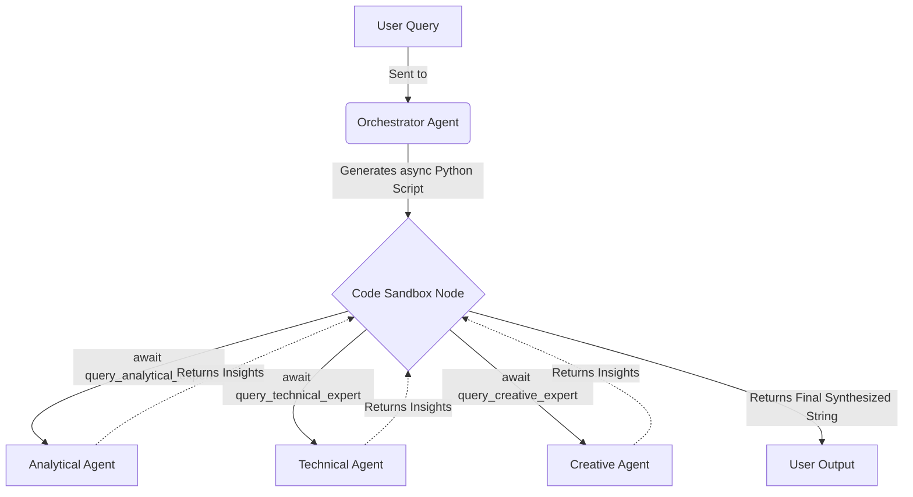

<div align="center">
  
# 🧠 Programmatic Multi-Agent Orchestration

**A Code-Driven Mixture of Experts (MoE) Architecture powered by LangGraph & Groq**

[](https://www.python.org/downloads/)
[](https://github.com/langchain-ai/langgraph)
[](https://groq.com)
[](https://streamlit.io)

*Stop writing static DAGs. Let the AI write its own multi-agent execution graphs on the fly.*

</div>

---

## ✨ The Paradigm Shift: Code-as-Orchestration

Traditional multi-agent frameworks rely on developer-defined, static Directed Acyclic Graphs (DAGs). This project introduces a vastly superior paradigm: **Code-as-Orchestration**. 

When a query arrives, our **Master Orchestrator** doesn't just route it through a static graph—it dynamically writes an **async Python script** to solve the problem. This script runs in a secure sandbox, programmatically awaiting **Micro-Agent Tools**, analyzing intermediate results natively in Python, and synthesizing the final answer.

### 🌟 Key Features

- **🧩 Dynamic Script Generation**: The Orchestrator writes custom `async` execution scripts for every unique query.
- **🛡️ Secure Code Sandbox**: Dynamically generated code is executed within an isolated local environment.
- **🤖 Transient Micro-Agents**: Specialized experts (Technical, Creative, Analytical, General) are spawned as API functions, returning results directly to the sandbox.
- **📉 Infinite Context Compression**: Intermediate agent dialogues stay inside sandbox variables, saving tokens and eliminating LangGraph state bloat.
- **⚡ Blazing Fast**: Powered by Groq's high-speed inference endpoints.
- **💻 Transparent UI**: The Streamlit interface displays the dynamically generated orchestration code in real-time.

---

## 🏗️ Architecture



### The Workflow

1. **Input**: A complex query arrives.
2. **Orchestrate**: The Orchestrator Agent generates an `async def orchestrate():` Python script based on the available micro-agents.
3. **Execute**: The `CodeSandboxNode` runs the script.
4. **Evaluate**: The script programmatically loops over data, queries specific micro-agents in parallel using `asyncio.gather()`, and evaluates conditions natively in Python.
5. **Output**: The sandbox returns the final synthesized text to the LangGraph state.

---

## 🚀 Quick Start

### Prerequisites
- Python 3.11+
- [UV](https://github.com/astral-sh/uv) (recommended) or pip
- Groq API key ([get one free](https://console.groq.com))

### Installation

```bash
# Clone the repository
git clone https://github.com/Narden91/Programmatic-Multi-Agent-Orchestration.git
cd Programmatic-Multi-Agent-Orchestration

# Install dependencies with UV (recommended)
uv sync

# Or with pip
pip install -e .
```

### Configuration

Create a `.env` file in the root directory:
```env
GROQ_API_KEY=your_groq_api_key_here
```

### Run the App

```bash
# With UV
uv run streamlit run ui/app.py

# Or with pip
streamlit run ui/app.py
```

Visit `http://localhost:8501` to access the chat interface and watch the orchestrator write code in real-time!

---

## 💻 Programmatic Usage

You can easily embed this programmatic MoE into your own async Python applications.

```python
import asyncio
from src.core.config import MoEConfig
from src.core.state import create_initial_state
from src.graph.builder import MoEGraphBuilder

async def main():
    # 1. Initialize Configuration
    config = MoEConfig(groq_api_key="your_key")
    graph = MoEGraphBuilder(config).build()
    
    # 2. Define State
    state = create_initial_state("Explain black holes. Compare them to an everyday object, then give the physics.")
    
    # 3. Execute the Graph
    result = await graph.ainvoke(state)
    
    # 4. View Results
    print("--- Generated Orchestration Code ---")
    print(result['generated_code'])
    
    print("\n--- Final Answer ---")
    print(result['final_answer'])

if __name__ == "__main__":
    asyncio.run(main())
```

---

## 🤖 Available Models

This architecture supports the following high-speed models natively via Groq:
- **meta-llama/llama-4-maverick-17b-128e-instruct** (Default Orchestrator & Experts)
- **llama-3.3-70b-versatile**
- **qwen/qwen3-32b**
- **moonshotai/kimi-k2-instruct-0905**

---

## 🧪 Testing

```bash
# Run manual integration tests
uv run tests/test_orchestrator.py
```

---

## 📄 License & Acknowledgments

This project is licensed under the MIT License.

Built with [LangGraph](https://github.com/langchain-ai/langgraph), [Groq](https://groq.com), and [Streamlit](https://streamlit.io).
Special thanks to the open-source AI engineering community.