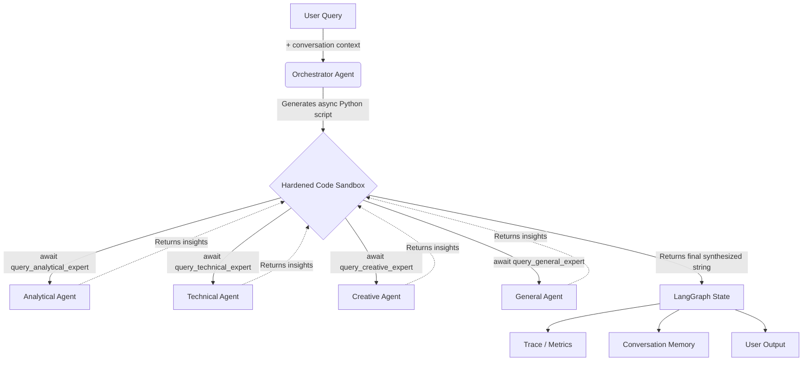

<div align="center">

# 🧠 Programmatic Multi-Agent Orchestration

**A Code-Driven Mixture of Experts (MoE) Architecture powered by LangGraph**

[](https://www.python.org/downloads/)
[](https://github.com/langchain-ai/langgraph)
[](https://groq.com)
[](https://openai.com)
[](https://anthropic.com)
[](https://react.dev)
[]()
[]()

*Stop writing static DAGs. Let the AI write its own multi-agent execution graphs on the fly.*

</div>

---

## ✨ The Paradigm Shift: Code-as-Orchestration

Traditional multi-agent frameworks rely on developer-defined, static Directed Acyclic Graphs (DAGs). This project introduces a vastly superior paradigm: **Code-as-Orchestration**.

When a query arrives, our **Master Orchestrator** doesn't just route it through a static graph — it dynamically writes an **async Python script** to solve the problem. This script runs in a hardened sandbox, programmatically awaiting **Micro-Agent Tools**, analyzing intermediate results natively in Python, and synthesizing the final answer.

### 🌟 Key Features

| Category | Feature |
|----------|---------|
| **Core** | 🧩 Dynamic `async` script generation per query |
| **Core** | 🛡️ Hardened code sandbox with AST validation, restricted builtins, and timeout enforcement |
| **Core** | 🤖 Transient micro-agents (Technical, Creative, Analytical, General) spawned as async tool functions |
| **Core** | 📉 Infinite context compression — intermediate dialogues stay in sandbox variables, saving tokens |
| **Multi-Provider** | ⚡ Groq (default), OpenAI, and Anthropic via a pluggable `LLMFactory` |
| **Multi-Provider** | 🔌 Per-expert provider override — mix Groq for speed and OpenAI for depth in the same pipeline |
| **Observability** | 📊 Real-time streaming trace system with async subscriptions |
| **Observability** | 📈 Token tracking with per-model cost estimation |
| **Observability** | 🔍 Static code analysis — AST-extracted execution plans before a single LLM call runs |
| **Memory** | 💬 Multi-turn conversation memory with sliding window and optional JSON persistence |
| **Memory** | 📚 Script bank — stores successful orchestration scripts for few-shot prompting |
| **Extensibility** | 🧩 Dynamic expert registry — add/remove expert types at runtime |
| **Extensibility** | 🏗️ Benchmark harness with standard suite for regression testing |
| **Security** | 🔒 `SecretStr` wrapper prevents API keys from leaking in repr/logs/tracebacks |
| **Security** | 🔒 Sandboxed `print()` with bounded buffer — no stdout exfiltration |
| **Security** | 🔒 Trace event redaction, bounded history, and file permission hardening |
| **UI** | 💻 React interface with FastAPI backend and real-time orchestration insights |

---

## 🏗️ Architecture



### The Workflow

1. **Input** — A query arrives, enriched with conversation context from the sliding-window memory.
2. **Orchestrate** — The Orchestrator generates an `async def orchestrate():` script, choosing which experts to call and whether to run them sequentially or in parallel (`asyncio.gather`).
3. **Validate** — The sandbox performs AST analysis: imports, dangerous attributes, and blocked builtins are rejected *before* any code runs.
4. **Execute** — The script runs inside a restricted `exec` with whitelisted builtins, a bounded `print` sink, and a configurable timeout.
5. **Observe** — Trace events stream in real time; token usage and cost are tracked per call.
6. **Output** — The sandbox returns the synthesized answer plus metadata (experts used, responses, execution plan) to the LangGraph state.

---

## 📁 Project Structure

```
src/
├── agents/
│   ├── base.py            # BaseAgent with retry logic
│   ├── orchestrator.py    # Orchestrator + CodeExecutor agents
│   ├── router.py          # Query router
│   ├── synthesizer.py     # Response synthesizer
│   ├── tools.py           # Sandbox tool function factory
│   ├── registry.py        # Dynamic expert registry
│   └── experts/
│       └── generic.py     # Generic expert implementation
├── core/
│   ├── config.py          # MoEConfig, SecretStr, LLMConfig, ExpertConfig
│   ├── sandbox.py         # Hardened sandbox with AST validation
│   └── state.py           # LangGraph state schema
├── graph/
│   └── builder.py         # LangGraph workflow builder
├── llm/
│   ├── prompts.py         # Prompt templates
│   └── providers.py       # LLMFactory: Groq, OpenAI, Anthropic
├── utils/
│   ├── cache.py           # LRU + TTL response cache
│   ├── code_analyzer.py   # AST-based execution plan extraction
│   ├── logging.py         # Structured logging
│   ├── memory.py          # Conversation memory (sliding window + persistence)
│   ├── metrics.py         # Token tracking & cost estimation
│   ├── script_bank.py     # Few-shot script memory bank
│   └── tracing.py         # Streaming trace system
├── benchmarks/
│   ├── suite.py           # BenchmarkSuite, BenchmarkCase, BenchmarkReport
│   └── run.py             # CLI benchmark runner
└── tests/                 # 103 tests (unit + integration)
```

---

## 🚀 Quick Start

### Prerequisites

- Python 3.11+
- [UV](https://github.com/astral-sh/uv) (recommended) or pip
- At least one LLM API key:
  - [Groq](https://console.groq.com) (free tier available — recommended)
  - [OpenAI](https://platform.openai.com) (optional)
  - [Anthropic](https://console.anthropic.com) (optional)

### Installation

```bash
# Clone the repository
git clone https://github.com/Narden91/Programmatic-Multi-Agent-Orchestration.git
cd Programmatic-Multi-Agent-Orchestration

# Install with UV (recommended)
uv sync

# Or with pip
pip install -e .

# Optional: install extra providers
pip install -e ".[openai]"       # OpenAI support
pip install -e ".[anthropic]"    # Anthropic support
pip install -e ".[all-providers]" # Both
```

### Configuration

Create a `.env` file in the root directory:

```env
GROQ_API_KEY=your_groq_api_key_here

# Optional — enable multi-provider support
# OPENAI_API_KEY=sk-...
# ANTHROPIC_API_KEY=sk-ant-...
```

### Run the App

#### Windows (PowerShell)

```powershell
# from repository root
./start.ps1
```

#### WSL / Linux / macOS (bash)

```bash
# from repository root
bash start.sh

# first run or after dependency/lockfile changes
bash start.sh --setup
```

Use the command exactly as plain bash (no VS Code preview link):

```bash
bash start.sh --setup
```

#### Manual startup (all platforms)

```bash
# Terminal 1 (backend)
uv run uvicorn api.main:app --reload --host 127.0.0.1 --port 8000

# Terminal 2 (frontend)
cd frontend
npm install
npm run dev
```

Frontend: `http://127.0.0.1:5173`  
Backend health: `http://127.0.0.1:8000/api/health`

> Important: if you see `http proxy error: /api/init ECONNREFUSED 127.0.0.1:8000`, the frontend is running but the backend is not reachable. Start the backend first and re-open the frontend.

### Recent Updates (Mar 2026)

- Added cross-platform launchers: `start.ps1` (Windows) and improved `start.sh` (Linux/WSL/macOS).
- `start.sh` now has a fast default mode and an explicit setup mode (`--setup`) to avoid reinstalling dependencies on every run.
- Improved backend env handling: `.env` loading is forced with override semantics and startup logs now show API key detection status.
- Added frontend init error visibility for easier diagnosis when backend is offline.
- Applied Vite vendor chunk splitting to reduce large bundle warnings.
- Refined UI with a pastel palette (avoiding pure white surfaces) and moved novelty details from Sidebar to Architecture/About.

---

## 💻 Programmatic Usage

```python
import asyncio
from src.core.config import MoEConfig, SecretStr
from src.core.state import create_initial_state
from src.graph.builder import MoEGraphBuilder

async def main():
    # 1. Configure (keys are wrapped in SecretStr to prevent leakage)
    config = MoEConfig(groq_api_key=SecretStr("your_key"))
    graph = MoEGraphBuilder(config).build()

    # 2. Create initial state
    state = create_initial_state(
        "Explain black holes. Compare them to an everyday object, "
        "then give the physics."
    )

    # 3. Execute the graph
    result = await graph.ainvoke(state)

    # 4. View results
    print("--- Generated Orchestration Code ---")
    print(result["generated_code"])

    print("\n--- Final Answer ---")
    print(result["final_answer"])

if __name__ == "__main__":
    asyncio.run(main())
```

### Multi-Provider Configuration

```python
from src.core.config import MoEConfig, SecretStr, ExpertConfig, LLMConfig

config = MoEConfig(
    groq_api_key=SecretStr("gsk_..."),
    openai_api_key=SecretStr("sk-..."),
    expert_configs={
        "technical": ExpertConfig(
            name="technical",
            description="Programming, technology, sciences",
            llm_config=LLMConfig(model_name="gpt-4o"),
            system_prompt="You are a technical expert.",
            provider_type="openai",          # ← this expert uses OpenAI
        ),
        "creative": ExpertConfig(
            name="creative",
            description="Storytelling, brainstorming",
            llm_config=LLMConfig(model_name="llama-3.3-70b-versatile"),
            system_prompt="You are a creative expert.",
            provider_type="groq",            # ← this one uses Groq
        ),
    },
)
```

### Dynamic Expert Registration

```python
from src.agents.registry import registry

registry.register(
    expert_type="legal",
    description="Contract law, compliance, regulation",
    system_prompt="You are a legal expert.",
    prompt_template='You are a legal expert.\n\nQuery: "{query}"\n\nRespond:',
)
# The "legal" expert is now available as `await query_legal_expert(...)` in generated scripts.
```

### Streaming Traces

```python
from src.utils.tracing import get_tracer

tracer = get_tracer()

async for event in tracer.subscribe():
    print(f"[{event.kind}] {event.agent}: {event.data}")
```

### Conversation Memory

```python
from src.utils.memory import ConversationMemory

mem = ConversationMemory(max_turns=10, persist_path="history.json")
mem.add("What is Python?", "Python is a programming language…")
context = mem.format_context()  # inject into prompts for follow-up awareness
```

---

## 🤖 Supported Models

### Groq (default)

| Model | Notes |
|-------|-------|
| `llama-3.3-70b-versatile` | Default for orchestrator & experts |
| `meta-llama/llama-4-maverick-17b-128e-instruct` | Fast, cost-effective |
| `qwen/qwen3-32b` | Strong reasoning |
| `moonshotai/kimi-k2-instruct-0905` | Multi-lingual |

### OpenAI (optional, requires `pip install -e ".[openai]"`)

Any model supported by `langchain-openai` (e.g. `gpt-4o`, `gpt-4o-mini`).

### Anthropic (optional, requires `pip install -e ".[anthropic]"`)

Any model supported by `langchain-anthropic` (e.g. `claude-sonnet-4-20250514`).

### Custom Providers

```python
from src.llm.providers import LLMFactory, LLMProvider

class MyProvider(LLMProvider):
    provider_name = "my_provider"
    def invoke(self, prompt): ...
    async def ainvoke(self, prompt): ...

LLMFactory.register_provider("my_provider", MyProvider)
```

---

## 🔒 Security

The system implements defence-in-depth across multiple layers:

| Layer | Protection |
|-------|-----------|
| **AST validation** | Imports, `__globals__`, `__builtins__`, `eval`, `exec`, `open`, `getattr`, and 20+ dangerous constructs are rejected *before* execution |
| **Restricted builtins** | Only a curated whitelist of safe builtins is exposed inside the sandbox |
| **Bounded stdout** | `print()` is replaced with a capped buffer (`_SandboxPrinter`, 10 KB limit) — no real stdout access |
| **Execution timeout** | `asyncio.wait_for` enforces configurable wall-clock limits (default 60 s) |
| **Secret protection** | API keys are wrapped in `SecretStr` — masked in `repr()`, `str()`, logs, and tracebacks |
| **Trace redaction** | User queries are excluded from trace events; history is bounded (default 500 entries) |
| **Error sanitization** | Internal exception details are logged only, not propagated to callers |
| **File permissions** | Persisted conversation files are written with `0o600` (owner-only) permissions |
| **No shell injection** | CLI uses `subprocess.run` with explicit argument lists — no `os.system` |
| **Cache integrity** | SHA-256 for cache key generation |

---

## 🧪 Testing

```bash
# Run the full test suite (103 tests)
python -m pytest tests/ -v

# With coverage report
python -m pytest tests/ --cov=src --cov-report=html

# Run only unit tests
python -m pytest tests/test_agents.py tests/test_graph.py tests/test_orchestrator.py -v

# Run integration tests (requires GROQ_API_KEY)
python -m pytest tests/test_integration.py tests/test_groq.py -v
```

### Benchmarks

```bash
# Run the standard benchmark suite (requires GROQ_API_KEY)
python -m benchmarks.run
```

---

## ⚙️ Environment Variables

| Variable | Default | Description |
|----------|---------|-------------|
| `GROQ_API_KEY` | — | Groq API key (required unless another provider is configured) |
| `OPENAI_API_KEY` | — | OpenAI API key (optional) |
| `ANTHROPIC_API_KEY` | — | Anthropic API key (optional) |
| `ORCHESTRATOR_MODEL` | `llama-3.3-70b-versatile` | Model for the orchestrator agent |
| `MAX_TOKENS` | `2000` | Maximum tokens per LLM call |
| `MAX_PARALLEL_EXPERTS` | `4` | Max concurrent expert calls |
| `REQUEST_TIMEOUT` | `60` | Sandbox execution timeout (seconds) |
| `MAX_RETRIES` | `3` | LLM call retry attempts |
| `ENABLE_CACHE` | `true` | Enable/disable response caching |
| `CACHE_TTL_SECONDS` | `3600` | Cache entry time-to-live |
| `LOG_LEVEL` | `INFO` | Logging verbosity |
| `DEBUG` | `false` | Enable debug mode |

### Verify API key loading

1. Create `.env` in repository root with:

```env
GROQ_API_KEY=your_groq_api_key_here
```

2. Start backend and check startup logs for:
    - `dotenv loaded from .../.env`
    - `GROQ_API_KEY detected: True`

3. Verify from browser or terminal:

```bash
curl http://127.0.0.1:8000/api/init
```

Expected JSON contains:

```json
{"has_env_api_key": true, "version": "0.5.0", "models": [...]}
```

---

## 📄 License & Acknowledgments

This project is licensed under the MIT License.

Built with [LangGraph](https://github.com/langchain-ai/langgraph), [LangChain](https://github.com/langchain-ai/langchain), [FastAPI](https://fastapi.tiangolo.com), and [React](https://react.dev).
Special thanks to the open-source AI engineering community.