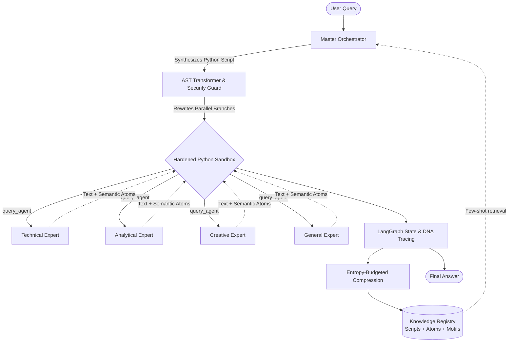

<div align="center">

# 🧠 Programmatic Multi-Agent Orchestration

**A Code-Driven Mixture of Experts (MoE) Architecture powered by LangGraph**

[](https://www.python.org/downloads/)
[](https://github.com/langchain-ai/langgraph)
[](https://groq.com)
[](https://openai.com)
[](https://anthropic.com)
[](https://react.dev)
[]()
[]()

*Stop writing static DAGs. Let AI write and execute its own multi-agent programs on the fly.*

[📖 System Architecture](docs/ARCHITECTURE.md) · [🗜️ Motif Compression](docs/COMPRESSION.md) · [🧪 Benchmark Suite](docs/BENCHMARKS.md)

</div>

---

## ✨ The Paradigm Shift: Code-as-Orchestration

Traditional multi-agent frameworks force you to build rigid, static flowcharts (DAGs). When complex user requests require flexible loops, parallel branch gathering, conditional fallbacks, or data transformations, static graphs quickly become brittle and unmaintainable.

**Programmatic Multi-Agent Orchestration** solves this by turning orchestration into **executable async Python code**:

1. **Synthesize**: The Master Orchestrator writes a dedicated `async def orchestrate()` script tailored for your specific query.
2. **Transform & Verify**: Independent sub-agent queries are automatically rewritten into `asyncio.gather(...)` for high-throughput concurrency, then verified against strict AST security rules.
3. **Execute & Learn**: The script runs in a hardened sandbox. Verifiable results, reasoning atoms, and plan motifs are compressed into a persistent knowledge registry for instant future reuse.

### 🌟 Key Features

| Domain | Innovation |
| :--- | :--- |
| **Dynamic Execution** | 🧩 Code-as-Orchestration synthesizes fresh `async def orchestrate()` programs per query |
| **Concurrency** | ⚡ AST Speculative Transformer converts sequential agent calls into `asyncio.gather(...)` |
| **Agent Contract** | 🤖 Unified `query_agent(agent_type, prompt)` returning text and verifiable `SemanticAtom` objects |
| **Entropy Compression** | 🗜️ **MOSAIC-MoE Dictionary Coding** reduces registry storage footprints by **52.7%** with lossless recovery |
| **Knowledge Graph** | 🕸️ Sub-graph memory indexing semantic atoms, dependency edges, and plan motifs |
| **Evaluation Suite** | 🧪 Automated benchmark harness with offline mock testing, multi-slice comparisons, and publication plots |
| **Multi-Provider** | 🔌 Mix and match Groq, OpenAI, and Anthropic seamlessly across different experts |
| **Hardened Sandbox** | 🔒 AST validation rejecting dangerous builtins, attribute traversal, and infinite loops |
| **Full-Stack UI** | 💻 Interactive React + FastAPI dashboard with live trace visualization |

---

## 🏗️ Architecture & Flow


```mermaid
graph TD
    User([User Query]) --> Orch[Master Orchestrator]
    Registry[(Knowledge Registry\nScripts + Atoms + Motifs)] -.->|Few-shot retrieval| Orch
    Orch -->|Synthesizes Python Script| AST[AST Transformer & Security Guard]
    AST -->|Rewrites Parallel Branches| Sandbox{Hardened Python Sandbox}
    Sandbox -->|query_agent| Tech[Technical Expert]
    Sandbox -->|query_agent| Anal[Analytical Expert]
    Sandbox -->|query_agent| Creat[Creative Expert]
    Sandbox -->|query_agent| Gen[General Expert]
    Tech -.->|Text + Semantic Atoms| Sandbox
    Anal -.->|Text + Semantic Atoms| Sandbox
    Creat -.->|Text + Semantic Atoms| Sandbox
    Gen -.->|Text + Semantic Atoms| Sandbox
    Sandbox --> State[LangGraph State & DNA Tracing]
    State --> Compress[Entropy-Budgeted Compression]
    Compress --> Registry
    State --> Output([Final Answer])
```

---

## 📁 Project Structure

```
.
├── api/                   # FastAPI backend (health, init, query streaming)
├── benchmarks/            # Benchmark harness, plotting engine, and slice suites
├── docs/                  # In-depth architectural & benchmark documentation
│   ├── ARCHITECTURE.md    # System design, tool contract, sandbox security
│   ├── BENCHMARKS.md      # CLI flags, test slices, and metric interpretations
│   └── COMPRESSION.md     # Entropy-budgeted motif dictionary coding
├── frontend/              # Modern React + Vite dashboard
├── src/
│   ├── agents/            # Orchestrator agent & dynamic expert registry
│   ├── core/              # Sandbox, AST transformer, compression, memory & scoring
│   ├── graph/             # LangGraph workflow builder
│   ├── llm/               # LLM factory (Groq, OpenAI, Anthropic) & prompts
│   └── utils/             # MotifDictionaryCoder, metrics, logging, tracing
└── tests/                 # 165+ Unit and integration tests
```

---

## 🚀 Quick Start

### Prerequisites

- Python 3.11+
- [UV](https://github.com/astral-sh/uv) (recommended) or pip
- At least one LLM API key:
  - [Groq](https://console.groq.com) (free tier available — recommended)
  - [OpenAI](https://platform.openai.com) (optional)
  - [Anthropic](https://console.anthropic.com) (optional)

### Installation

```bash
# Clone the repository
git clone https://github.com/Narden91/Programmatic-Multi-Agent-Orchestration.git
cd Programmatic-Multi-Agent-Orchestration

# Install with UV (recommended)
uv sync

# Or with pip
pip install -e .

# Optional: install extra providers
pip install -e ".[openai]"       # OpenAI support
pip install -e ".[anthropic]"    # Anthropic support
pip install -e ".[all-providers]" # Both
```

### Configuration

Create a `.env` file in the root directory:

```env
GROQ_API_KEY=your_groq_api_key_here

# Optional — enable multi-provider support
# OPENAI_API_KEY=sk-...
# ANTHROPIC_API_KEY=sk-ant-...
```

### Run the App

#### Windows Native (Recommended)

Start the entire stack (Vite + Uvicorn) seamlessly using the provided PowerShell script. It automatically manages dependencies, builds the frontend if needed, handles WSL artifact cleanup (preventing `Access Denied` errors), and totally suppresses standard PyTorch/Transformers downloading console spam.

```powershell
# from repository root
.\start.ps1
```

*(Note: Use `.\start.ps1 -Build` to force a production frontend compilation before booting).*

#### Manual startup (all platforms)

```bash
# Terminal 1 (backend)
uv run uvicorn api.main:app --reload --host 127.0.0.1 --port 8000

# Terminal 2 (frontend)
cd frontend
npm install
npm run dev
```

Frontend: `http://127.0.0.1:5173`  
Backend health: `http://127.0.0.1:8000/api/health`

> Important: if you see `http proxy error: /api/init ECONNREFUSED 127.0.0.1:8000`, the frontend is running but the backend is not reachable. Start the backend first and re-open the frontend.

### Recent Updates (August 2026)

- **Entropy-Budgeted Compression (MOSAIC-MoE)**: Integrated online motif dictionary coding and zlib deflate compression in `MotifDictionaryCoder`, reducing registry storage footprint by **52.7%** with transparent on-read decompression.
- **Dynamic Motif Discovery & Persistence**: Discovered recurring orchestration n-grams are automatically registered and persisted across instances in the SQLite `motif_dictionary` table.
- **Enhanced Benchmark Suite**: CLI support for `--compression-slice` and `--mock-llm` for instant deterministic offline evaluations, recovery rate metrics, and publication-ready comparison plot exports.
- **Semantic Memory Graph**: Persists full semantic atom payloads, dependency edges (`atom_edges`), and plan motifs (`plan_motifs`) alongside execution scripts.
- **Graph-Aware Retrieval & Selection Bias**: Orchestrator leverages atom-level few-shot hints, dependency neighborhoods, and metadata-ranked candidate search.
- **Sandbox Security Hardening**: Strict AST validation rejecting unsafe builtins, attribute traversal, and unawaited property accesses before execution.

---

## 💻 Programmatic Usage

```python
import asyncio
from src.core.config import MoEConfig, SecretStr
from src.core.state import create_initial_state
from src.graph.builder import MoEGraphBuilder

async def main():
    # 1. Configure (keys are wrapped in SecretStr to prevent leakage)
    config = MoEConfig(groq_api_key=SecretStr("your_key"))
    graph = MoEGraphBuilder(config).build()

    # 2. Create initial state
    state = create_initial_state(
        "Explain black holes. Compare them to an everyday object, "
        "then give the physics."
    )

    # 3. Execute the graph
    result = await graph.ainvoke(state)

    # 4. View results
    print("--- Generated Orchestration Code ---")
    print(result["generated_code"])

    print("\n--- Final Answer ---")
    print(result["final_answer"])

if __name__ == "__main__":
    asyncio.run(main())
```

### Multi-Provider Configuration

```python
from src.core.config import MoEConfig, SecretStr, ExpertConfig, LLMConfig

config = MoEConfig(
    groq_api_key=SecretStr("gsk_..."),
    openai_api_key=SecretStr("sk-..."),
    expert_configs={
        "technical": ExpertConfig(
            name="technical",
            description="Programming, technology, sciences",
            llm_config=LLMConfig(model_name="gpt-4o"),
            system_prompt="You are a technical expert.",
            provider_type="openai",          # ← this expert uses OpenAI
        ),
        "creative": ExpertConfig(
            name="creative",
            description="Storytelling, brainstorming",
            llm_config=LLMConfig(model_name="llama-3.3-70b-versatile"),
            system_prompt="You are a creative expert.",
            provider_type="groq",            # ← this one uses Groq
        ),
    },
)
```

### Dynamic Expert Registration

```python
from src.agents.tools import register_expert

register_expert(
    expert_type="legal",
    description="Contract law, compliance, regulation",
    prompt_template='You are a legal expert.\n\nQuery: "{query}"\n\nRespond:',
    system_prompt="You are a legal expert.",
)

# The "legal" expert is now available to generated sandbox code as:
# result = await query_agent("legal", "Review this clause")
```

### Streaming Traces

```python
from src.utils.tracing import get_tracer

tracer = get_tracer()

async for event in tracer.subscribe():
    print(f"[{event.kind}] {event.agent}: {event.data}")
```

### Conversation Memory

```python
from src.utils.memory import ConversationMemory

mem = ConversationMemory(max_turns=10, persist_path="history.json")
mem.add("What is Python?", "Python is a programming language…")
context = mem.format_context()  # inject into prompts for follow-up awareness
```

---

### Groq (Default High-Speed LPU Inference)

| Model | Role / Strengths |
|---|---|
| `llama-3.1-8b-instant` | **Default Orchestrator & Expert Model** — sub-100ms latency with generous rate limits |
| `gpt-oss-120b` | Flagship open-weights foundation model optimized for Groq LPUs |
| `gpt-oss-20b` | Ultra-fast, high-throughput model for lightweight micro-agent queries |
| `qwen-3.6-27b` | Advanced reasoning and multilingual expert on Groq |
| `llama-3.3-70b-versatile` | High-capacity open model for complex multi-expert Python synthesis |
| `deepseek-r1-distill-llama-70b` | Specialized mathematical, algorithmic, and formal reasoning expert |
| `llama-3.2-11b-vision-preview` | Multimodal model for image/text orchestration workflows |
| `mixtral-8x7b-32768` | Long-context Mixture of Experts (32k context) |
| `gemma2-9b-it` | Google Gemma 2 high-efficiency instruct model |

### OpenAI (Optional, `pip install -e ".[openai]"`)

| Model | Role / Strengths |
|---|---|
| `gpt-5.6-sol` | **Frontier Flagship** — complex multi-step reasoning, agentic coding, research, and tool use |
| `gpt-5.6-terra` | Balanced high-intelligence daily driver with optimized cost-efficiency |
| `gpt-5.6-luna` | High-throughput, low-latency model for high-volume orchestration pipelines |
| `gpt-5.4-mini` | Compact lightweight model for micro-agent subtasks |
| `gpt-4o` / `gpt-4o-mini` | Multimodal workhorse models with established benchmark profiles |
| `o3-mini` / `o1` | Deep reasoning models with configurable thinking effort |

### Anthropic (Optional, `pip install -e ".[anthropic]"`)

| Model | Role / Strengths |
|---|---|
| `claude-opus-5` | **Frontier Flagship** — state-of-the-art agentic software engineering, long-horizon planning, and deep analysis |
| `claude-sonnet-5` | Primary recommended daily driver balancing speed, cost ($2/$10 per M), and intelligence |
| `claude-fable-5` | Mythos-class reasoning tailored for complex multi-agent execution graphs |
| `claude-haiku-4-5` | Ultra-fast, responsive Claude model with high intelligence density |
| `claude-3-7-sonnet-latest` | Hybrid reasoning model with dynamic step-by-step thinking |
| `claude-3-5-sonnet-20241022` | Battle-tested coding and tool-use model |
| `claude-3-opus-latest` | Deep comprehension and nuanced synthesis |

### Custom Providers

```python
from src.llm.providers import LLMFactory, LLMProvider

class MyProvider(LLMProvider):
    provider_name = "my_provider"
    def invoke(self, prompt): ...
    async def ainvoke(self, prompt): ...

LLMFactory.register_provider("my_provider", MyProvider)
```

---

## 🔒 Security

The system implements defence-in-depth across multiple layers:

| Layer | Protection |
|-------|-----------|
| **AST validation** | Imports, `__globals__`, `__builtins__`, `eval`, `exec`, `open`, `getattr`, and 20+ dangerous constructs are rejected *before* execution |
| **Restricted builtins** | Only a curated whitelist of safe builtins is exposed inside the sandbox |
| **Bounded stdout** | `print()` is replaced with a capped buffer (`_SandboxPrinter`, 10 KB limit) — no real stdout access |
| **Execution timeout** | `asyncio.wait_for` enforces configurable wall-clock limits (default 120 s) |
| **Secret protection** | API keys are wrapped in `SecretStr` — masked in `repr()`, `str()`, logs, and tracebacks |
| **Trace redaction** | User queries are excluded from trace events; history is bounded (default 500 entries) |
| **Error surface** | Full tracebacks stay server-side; API callers receive the exception message without the traceback |
| **File permissions** | Persisted conversation files are written with `0o600` (owner-only) permissions |
| **No shell injection** | CLI uses `subprocess.run` with explicit argument lists — no `os.system` |
| **Cache integrity** | SHA-256 for cache key generation |

---

## 🧪 Testing

```bash
# Run the full test suite
python -m pytest tests/ -v

# With coverage report
python -m pytest tests/ --cov=src --cov-report=html

# Run only unit tests
python -m pytest tests/test_agents.py tests/test_graph.py tests/test_orchestrator.py -v

# Run provider-backed integration tests (requires GROQ_API_KEY)
python -m pytest tests/test_integration.py tests/test_groq.py -v

# Run the live orchestrator integration path explicitly
RUN_LIVE_GROQ_TESTS=1 python -m pytest tests/test_orchestrator.py -m live_groq -v
```

`tests/test_orchestrator.py` is deterministic by default: the live Groq end-to-end case is gated behind the `live_groq` marker and `RUN_LIVE_GROQ_TESTS=1` so normal cleanup and regression runs do not consume provider quota.

### Benchmarks

```bash
# Run the standard benchmark suite (requires GROQ_API_KEY)
python -m benchmarks.run

# Run each benchmark case 5 times and print per-case aggregates
python -m benchmarks.run --repeats 5

# Compare baseline retrieval vs metadata-biased candidate selection
python -m benchmarks.run --repeats 5 --selection-bias-slice

# Compare baseline retrieval vs graph-aware warm-task retrieval
python -m benchmarks.run --repeats 5 --warm-task-slice

# Use a smaller model for quota-aware smoke slices (applies to orchestrator and experts)
python -m benchmarks.run --model llama-3.1-8b-instant --filter single_technical --selection-bias-slice

# Save a before/after slice as JSON plus a comparison figure
python -m benchmarks.run --model llama-3.1-8b-instant --repeats 5 --selection-bias-slice --output-json artifacts/selection_bias.json --plot-output artifacts/selection_bias.png

# Re-render a saved benchmark JSON into a plot with a custom title
python -m benchmarks.plotting artifacts/selection_bias.json --output artifacts/selection_bias.pdf --title "Selection-Bias Slice"
```

---

## ⚙️ Environment Variables

| Variable | Default | Description |
|----------|---------|-------------|
| `GROQ_API_KEY` | — | Groq API key (required unless another provider is configured) |
| `OPENAI_API_KEY` | — | OpenAI API key (optional) |
| `ANTHROPIC_API_KEY` | — | Anthropic API key (optional) |
| `ORCHESTRATOR_MODEL` | `llama-3.1-8b-instant` | Model for the orchestrator agent |
| `MAX_TOKENS` | `2000` | Maximum tokens per LLM call |
| `MAX_PARALLEL_EXPERTS` | `4` | Max concurrent expert calls |
| `REQUEST_TIMEOUT` | `120` | Sandbox execution timeout (seconds) |
| `MAX_RETRIES` | `3` | LLM call retry attempts |
| `ORCHESTRATOR_CANDIDATES` | `1` | Number of candidate scripts generated per request; values >1 enable heuristic pre-selection |
| `ORCHESTRATOR_SCRIPT_FEW_SHOTS` | `2` | Number of script-level few-shot examples retrieved for the orchestrator prompt |
| `ORCHESTRATOR_ATOM_FEW_SHOTS` | `4` | Number of atom-level few-shot hints retrieved from `script_atoms` |
| `ENABLE_ATOM_FEW_SHOT_RETRIEVAL` | `true` | Enable/disable atom-level few-shot prompt hints from the registry |
| `ENABLE_METADATA_SELECTION_BIAS` | `true` | Enable/disable metadata-aware candidate ranking using prior atom-rich parallel scripts |
| `REGISTRY_DB_PATH` | `.moe_registry.db` | SQLite registry used for scripts, atoms, motifs, and learning metadata |
| `SANDBOX_ISOLATE_PROCESS` | `false` on Windows / `true` elsewhere | Whether to run the sandbox in a separate process |
| `SANDBOX_MAX_CODE_CHARS` | `30000` | Maximum generated code size accepted by the sandbox |
| `SANDBOX_MAX_AST_NODES` | `8000` | Maximum AST node count allowed before execution |
| `SANDBOX_MAX_STATEMENTS` | `1500` | Maximum statement count allowed before execution |
| `SANDBOX_MAX_QUERY_CALLS` | `120` | Maximum number of `query_agent(...)` calls allowed in a script |
| `ENABLE_CACHE` | `true` | Enable/disable response caching |
| `CACHE_TTL_SECONDS` | `3600` | Cache entry time-to-live |
| `LOG_LEVEL` | `INFO` | Logging verbosity |
| `DEBUG` | `false` | Enable debug mode |

`LLMConfig.from_env()` also supports per-role overrides such as `TECHNICAL_MODEL`, `ANALYTICAL_MODEL`, `CREATIVE_MODEL`, `GENERAL_MODEL`, and `CRITICAL_THINKER_MODEL`.

### Verify API key loading

1. Create `.env` in repository root with:

```env
GROQ_API_KEY=your_groq_api_key_here
```

2. Start backend and check startup logs for:
    - `dotenv loaded from .../.env`
    - `GROQ_API_KEY detected: True`

3. Verify from browser or terminal:

```bash
curl http://127.0.0.1:8000/api/init
```

Expected JSON contains:

```json
{"has_env_api_key": true, "version": "1.1.0", "models": [...]} 
```

---

## 📄 License & Acknowledgments

This project is licensed under the MIT License.

Built with [LangGraph](https://github.com/langchain-ai/langgraph), [LangChain](https://github.com/langchain-ai/langchain), [FastAPI](https://fastapi.tiangolo.com), and [React](https://react.dev).
Special thanks to the open-source AI engineering community.