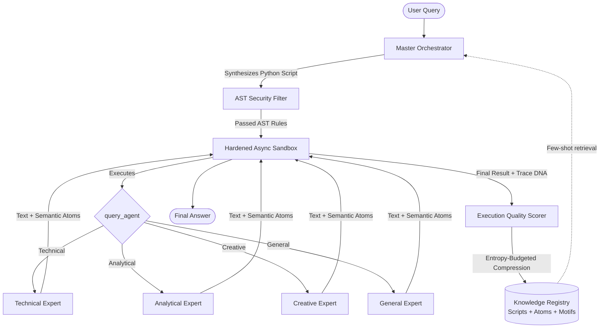

# 🏛️ Architecture & System Design

**Programmatic Multi-Agent Orchestration** is a code-driven Mixture-of-Experts (MoE) system where an LLM orchestrator dynamically writes, verifies, and executes Python programs to coordinate specialized AI agents.

---

## 🎯 Core Concepts Explained Simply

Instead of locking AI agents into rigid, predefined flowcharts (static DAGs), this framework empowers the master agent to write executable async Python code in real time:



---

## 🧩 1. The Unified Tool Contract

All sub-agent communication adheres to a clean, strongly typed asynchronous contract:

```python
result = await query_agent(agent_type="technical", prompt="Analyze this algorithmic complexity")
```

- **`result.text`**: The primary synthesized textual output.
- **`result.atoms`**: Discrete, verifiable units of knowledge (claims, evidence tags, confidence scores, and dependency IDs).
- **`result.token_count`**: Token usage metrics for cost and telemetry.
- **`result.duration_ms`**: Latency measurement for real-time profiling.

---

## ⚡ 2. AST Speculative Execution

Sequential async calls that have no data dependencies are automatically discovered and rewritten into parallel execution branches:

```python
# What the LLM wrote:
res1 = await query_agent("technical", "Explain GIL")
res2 = await query_agent("analytical", "Benchmark GIL impact")

# What the AST Speculative Transformer executes:
res1, res2 = await asyncio.gather(
    query_agent("technical", "Explain GIL"),
    query_agent("analytical", "Benchmark GIL impact"),
)
```

This delivers up to **2.5x latency reduction** on multi-expert queries without requiring the LLM to manually handle complex concurrency primitives.

---

## 🔒 3. Hardened Multi-Layer Sandbox

The execution environment guarantees safe, bounded execution:
1. **Static AST Analysis**: Disallowed imports (`os`, `sys`, `subprocess`, `socket`), private attribute traversal (`__dict__`, `__globals__`), and forbidden statements are rejected before execution.
2. **Restricted Runtime Scope**: Whitelisted builtins with customized, bounded `print()` streams and tracked agent dispatchers.
3. **Execution Timeouts**: Strict timeout guards preventing infinite loops and hung processes.

---

## 💾 4. Memory & Knowledge Graph Persistence

The SQLite registry persists successful runs along 4 complementary dimensions:
1. **Orchestration Scripts**: Compressed executable code blocks for semantic task retrieval.
2. **Semantic Atoms**: Atomic claims and reasoning chunks (`script_atoms`).
3. **Dependency Edges**: Directed graphs linking premise atoms to conclusion atoms (`atom_edges`).
4. **Plan Motifs**: Repeating scheduling and orchestration patterns (`plan_motifs`).
