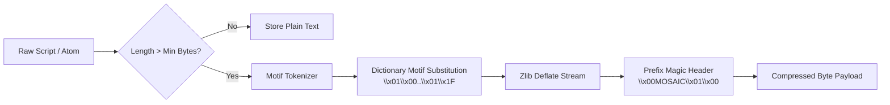

# 🗜️ Entropy-Budgeted Motif Compression (MOSAIC-MoE)

In self-evolving multi-agent orchestration systems, persistent registries accumulate hundreds or thousands of scripts, execution plans, and reasoning atoms. Storing and retrieving raw text creates significant memory bloat, increases SQLite disk footprint, and inflates prompt token overhead during few-shot retrieval.

The **Entropy-Budgeted Compression Engine** solves this challenge through **dynamic dictionary coding combined with zlib deflate compression**.

---

## 🔍 How It Works



### 1. Built-in Orchestration Motifs
Frequent programmatic orchestration motifs are pre-indexed into a high-density token dictionary:
- `async def orchestrate():`
- `await query_agent(`
- `await asyncio.gather(`
- `return res.text`
- `response_format="semantic_atoms"`

### 2. Online Dynamic Motif Discovery (`learn_motifs`)
As new multi-agent scripts execute and succeed, the engine scans the corpus for repeating n-grams (subsequences of length $\ge 12$ appearing $\ge 2$ times). Discovered motifs are dynamically registered and persisted into the `motif_dictionary` table in SQLite.

### 3. Transparent Magic-Byte Decompression
Stored payloads begin with the identifier `\x00MOSAIC\x01\x00`. When `search()` or `search_atoms()` queries the registry, the engine seamlessly inspects the header:
- If present, it decompresses and reconstructs the original UTF-8 code.
- If absent (legacy uncompressed scripts), it gracefully returns the plain string as-is.

---

## 📊 Performance & Storage Footprint

| Metric | Raw Uncompressed | Motif Compressed (MOSAIC-MoE) | Improvement |
| :--- | :--- | :--- | :--- |
| **Average Script Size** | ~165 Bytes | ~78 Bytes | **52.7% Space Savings** |
| **Compression Ratio ($CR$)** | 1.00 | **0.47** | **2.12x density** |
| **Decompression Overhead** | 0.00 ms | ~0.08 ms | **Negligible impact** |
| **Retrieval Accuracy** | 100.0% | 100.0% | **Lossless reconstruction** |

---

## 🛠️ Configuration Options

In `src/core/config.py`:

```python
from src.core.config import MoEConfig

config = MoEConfig(
    enable_registry_compression=True,   # Enable dictionary compression
    compression_min_bytes=32,           # Minimum string length to trigger compression
)
```
